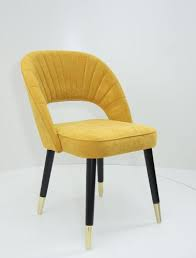

# Клиент: ErgoShell — офисные стулья

## Контекст
- Производят один «стиль» стульев: **сиденье-ракушка + простая опора**.

## Узкие требования (распределение узкое)
- Деталь всегда состоит из:
  - **сиденья** (тонкая оболочка) и
  - **4 ножек** (цилиндры/конусы).
- Отверстия крепления сиденья: **4 отверстия** по фиксированному прямоугольнику.

## Что надо уметь восстановить из STL
- Наличие операции **shell/толщина** для сиденья.
- 4 ножки с разумным наклоном.

## Пример

