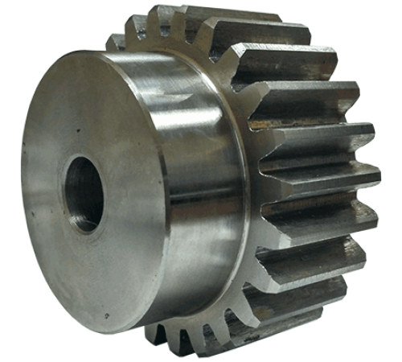

# Клиент: HeliGear — простые шестерни

## Контекст
- Делают только **шестерни** для маленьких приводов.

## Узкие требования
- Только **цилиндрическая шестерня** (без конических/внутренних).
- Вариативность небольшая: число зубьев, ширина, отверстие под вал.

## Что надо восстановить из STL
- Правильное **число зубьев** (периодичность).
- Отверстие (bore) в центре, иногда — простой паз (keyway).

## Ограничения для генератора (делаем просто)
- Тип: spur (прямая).
- Число зубьев: 12–40.

## Пример 

