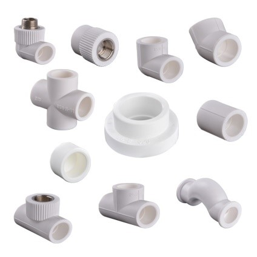

# Клиент: HydroFit — простые фитинги труб

## Контекст
- Каталог деталей очень узкий: **уголки/тройники/переходники**.

## Узкие требования
- Геометрия осевая и «трубная»: цилиндры + плавные сопряжения.

## Что надо восстановить из STL
- Тип детали: 90°-уголок или тройник (можно начать только с уголка).
- Диаметры вход/выход (из дискретного набора).
- Скругления/сопряжения.

## Ограничения для генератора (делаем просто)
- Только 90° уголок.

## Пример

