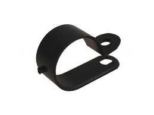

# Клиент: StrapClamp — простая кабельная клипса (P-clip)

## Контекст
- Производят простые крепления для проводов/шлангов.
- Деталь одна, штампованная/гнутая полоска + отверстия под крепёж.

## Узкие требования
- Деталь всегда имеет форму **дуги (U/P-образная скоба)** для обхвата кабеля и **крепёжной площадки**.
- На площадке есть **1–2 круглых сквозных отверстия**.
- Никаких защёлок, резьбы, зенковки, логотипов, текстур.

## Что надо восстановить из STL
- Диаметр обхвата (радиус дуги) → соответствует диаметру кабеля.
- Толщину и ширину полосы (ленты).
- Количество отверстий (1/2), их диаметр и шаг (если 2 отверстия).

## Пример
