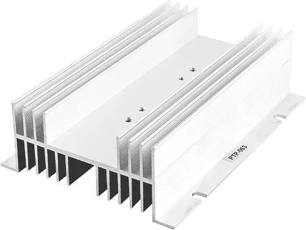

# Клиент: FinCool — алюминиевые радиаторы-экструзии с рёбрами

## Контекст
- Производят радиаторы из алюминиевого профиля для силовой электроники.
- Номенклатура узкая: один базовый “профиль” с рёбрами, меняются длина/толщина/отверстия/прорези.

## Узкие требования
- Радиатор — это **экструдированный профиль**: одно и то же поперечное сечение по всей длине.
- В сечении:
  - **плоское основание** (площадка под компонент),
  - **параллельные рёбра** (fin array) по двум сторонам основания,
  - иногда **боковые полки/уши** для крепления.
- Допускаются только простые “технологические” элементы:
  - **сквозные отверстия** под винты,
  - **прямоугольные прорези/канавки** на основании.
- Никаких сложных фасонных поверхностей, логотипов, текстуры на рёбрах.

## Что надо восстановить из STL
- Длину экструзии (глубину детали).
- Параметры поперечного сечения:
  - толщину основания,
  - высоту рёбер,
  - число рёбер и их шаг/толщину,
  - наличие и размер крепёжных “ушей” (если есть).
- Отверстия: количество, диаметр, расположение (обычно вдоль оси длины).
- Прорези/канавки на основании (если есть): ширина/глубина/позиция.

## Пример
