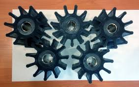

# Клиент: PumpWorks — простые импеллеры

## Контекст
- Импеллеры для насосов: вращательная структура + лопатки.

## Узкие требования
- Простая параметризация: диск/ступица + N лопаток.

## Что надо восстановить из STL
- Число лопаток.
- Внешний диаметр и отверстие в ступице.
- То, что лопатки «загнуты назад» (можно приблизительно).

## Ограничения для генератора (делаем просто)
- Число лопаток: {5, 6, 7}.

## Пример 

