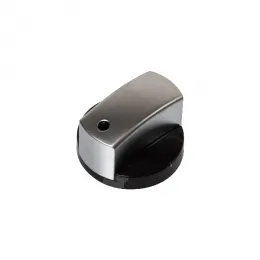

# Клиент: SmoothDial — гладкие ручки-регуляторы (одна деталь)

## Контекст
- Простые ручки для приборов/техники: гладкая форма без насечки.
- На реальных изделиях иногда есть чёрная вставка/выемка, но для CAD это **не важно**.

## Узкие требования
- Деталь всегда является **суперпозицией двух простых объёмов**:
  1) **цилиндрическое основание** (диск/цилиндр),
  2) **верхняя “крышка”** в виде **сектора цилиндра** (полуцилиндр / «D-образная» накладка) с плавными скруглениями.
- **Отверстий нет.**
- Чёрная зона на фото — это **выемка/вставка/покраска**: её **можно полностью игнорировать** (не моделировать, не красить).

## Что надо восстановить из STL
- Диаметр и высоту основания.
- Геометрию верхней части:
  - высоту,
  - радиус/ширину,
  - угол/долю сектора (например, “полуцилиндр” или ~120–200°).
- Скругления на кромках (можно приближённо).

## Пример
